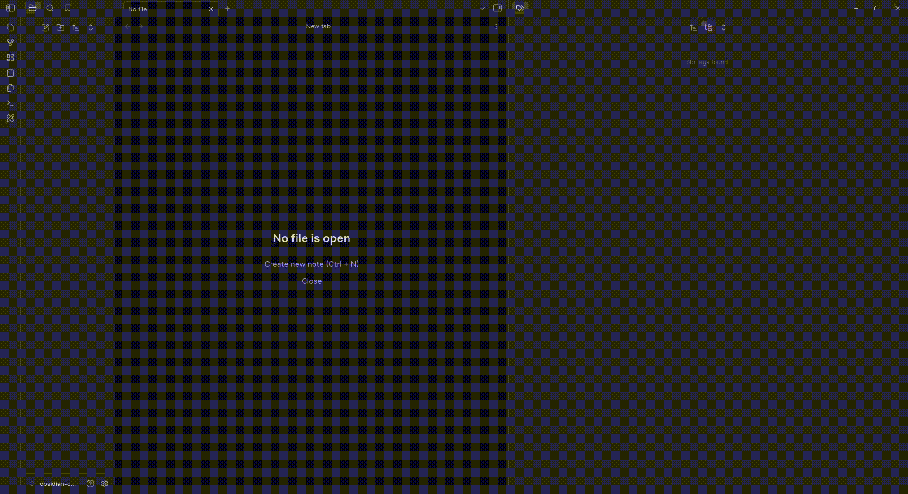

# Simple Sketch

## Overview

Simple Sketch is a plugin for [Obsidian](https://obsidian.md). It allows users to create simple sketches in a dedicated view with a minimal, convenient interface that emphasizes productivity over completeness.



## Installation

### For Contributors

1. Fork the repository on GitHub.

2. Clone your forked repository in your obsidian plugins folder:

    ```sh
    git clone git@github.com:your-username/obsidian-simple-sketch.git
    cd simple-sketch-plugin
    ```

3. Install the dependencies:

    ```sh
    npm install
    ```

4. Build the project:

    ```sh
    npm run build
    ```

5. Run the project:

    ```sh
    npm run dev
    ```

### For Users

1. Clone the repository in your obsidian plugins folder:

    ```sh
    git clone git@github.com:Yohh/obsidian-simple-sketch.git
    cd simple-sketch-plugin
    ```

2. Install the dependencies:

    ```sh
    npm install
    ```

3. Build the project:

    ```sh
    npm run build
    ```

## Usage

1. Open Obsidian and navigate to the settings.
2. Go to the "Community plugins" section and enable the "Simple Sketch" plugin.
3. Once enabled, you will see a new ribbon icon with a pencil and ruler.
4. Click on the ribbon icon to open the Simple Sketch view.
5. In the Simple Sketch view, you can:
    - Draw freehand sketches.
    - Generate shapes like lines, rectangles, and ellipses.
    - Add text to your sketches.
    - Save your sketches in the vault or download them as images.

Enjoy creating your sketches with Simple Sketch!

## Contribution

Contributions are welcome! Please follow these steps to contribute:

1. Fork the repository.
2. Create a new branch for your feature or bugfix.
3. Make your changes and commit them with clear messages.
4. Push your changes to your fork.
5. Create a pull request to the main repository.

## Work in progress

I am actively working on the following features and improvements:

-   **Enhanced Drawing Tools**: Adding more shapes and tools for better sketching capabilities.
-   **bugfix**: Fixing issues related to drawing precision and performance.

This plugin is a contribution to the Obsidian community, and I work on it in my free time. As a result, I may be slow to react if anything is asked. Thank you for your understanding and patience.

Stay tuned for updates and feel free to contribute to these features!

## Issues

If you encounter any issues or have any questions, please open an issue on the [GitHub repository](https://github.com/Yohh/obsidian-simple-sketch/issues).

## Support

If you would like to support the development of this plugin, you can make a donation through Buy Me a Coffee

[](https://buymeacoffee.com/yohh)

Thank you for your support!

## License

This project is licensed under the GNU Lesser General Public License. See the [LICENSE](LICENSE) file for more details.
